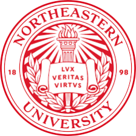
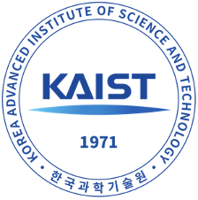
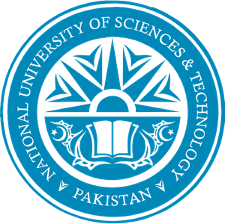

I am a PhD candidate in Electrical Engineering at [Northeastern University](https://www.northeastern.edu/), working with the [Machine Learning group @ SPIRAL](https://mllabneu.github.io/) supervised by [Professor Jennifer Dy](https://scholar.google.com/citations?user=6h7b0fAAAAAJ&hl=en). My current research interests include continual learning, adversarial attacks, and leveraging them for transparent and interpretable machine learning. Additionally, I have worked on unsupervised 3D reconstruction and classification, time-series forecasting and implicit neural networks. 

Previously, I worked as an AI and ML consultant with [Endress+Hauser, Germany](https://www.endress.com/en). I completed my Masters in EE at the [Robotics and Computer Vision](http://rcv.kaist.ac.kr/index.php?mid=rcv_01_01) lab at [KAIST, South Korea](https://www.kaist.ac.kr/en/), under the supervision of [Professor In So Kweon](https://scholar.google.com/citations?hl=en&user=XA8EOlEAAAAJ). I worked on occlusion‐robust vehicle re‐identification, and on utilizing adversarial attacks for understanding deep networks with relevant publications.

Besides my academic interests, I enjoy community service and reading biographies.

## Research Interests
- Self-supervised continual learning 
- Adversarial attacks for robust and interpretable ML
- 3D object detection, representation learning and reconstruction
- 2D object detection, segmentation and tracking

## Work Experience
<!-- {: style="float: left; width=80"}
Sept 2021 - Present\
Graduate Research Assistant at Machine Learning Lab, [SPIRAL](https://mllabneu.github.io/). -->

 &nbsp;&nbsp; May 2024 ~ \
&nbsp;&nbsp; Research Intern, [Project Starline](https://blog.google/technology/research/project-starline/), Google LA

 &nbsp;&nbsp; Sept 2021 - Present\
&nbsp;&nbsp; Graduate Research Assistant at [Machine Learning Lab](https://mllabneu.github.io/), [SPIRAL](https://web.northeastern.edu/spiral/)

 &nbsp;&nbsp; Sept 2020 - Aug 2021\
&nbsp;&nbsp; External Consultant for ML and AI

 &nbsp;&nbsp; Sept 2018 - Aug 2020\
&nbsp;&nbsp; Graduate Research Assistant at [Robotics and Computer Vision (RCV) Lab](http://rcv.kaist.ac.kr/index.php?mid=rcv_01_01)

 &nbsp;&nbsp; Sept 2015 - May 2018\
&nbsp;&nbsp; Research Intern at [TUKL NUST R&D Centre](https://tukl.seecs.nust.edu.pk/)

## News
- [03/16/2024] I will be interning with the [Project Starline](https://blog.google/technology/research/project-starline/) team at Google this Summer!
- [05/01/2023] I will be serving as a workflow chair for [AAAI 2024](https://aaai.org/aaai-conference/).
- [12/01/2022] Passed my PhD Qualification Exam.
- [07/18/2022] Presented my research on Sparse and Interpretable Adversarial Attacks at WiML Workshop @ [ICML'22](https://icml.cc/Conferences/2022).
- [09/01/2021] Started my PhD at Northeastern University, under the supervision of [Professor Jennifer Dy](https://mllabneu.github.io/).
- [09/01/2020] Starting working as a Consultant for ML/AI at [Endress+Hauser, Germany](https://www.endress.com/en) (remote).
- [06/28/2020] Completed my MS in Electrical Engineering at KAIST under the supervision of Professor In So Kweon.
- [06/15/2020] Successfully defended my Master's thesis titled "Occlusion-Robust Object Re-identification".
- [12/20/2019] Gave an invited talk about my research on adversarial attacks at [KEEP-I (KAIST EE Partners - International)](https://ee.kaist.ac.kr/en/event/17315/).
- [09/06/2019] Delivered an invited talk reflecting on my academic and overall experience at KAIST at [KAIST EE camp](https://ee.kaist.ac.kr/en/event/17081/).
- [09/01/2018] Started my Master's at KAIST supervised by [Professor In So Kweon](https://scholar.google.com/citations?hl=en&user=XA8EOlEAAAAJ).

## Ongoing Projects
Updating soon.

## Teaching
- [EECE7397 Advanced Machine Learning](https://www.coursicle.com/neu/courses/EECE/7397/), Northeastern University: Teaching Assistant with Professor Jennifer Dy.

## Academic Service
- Workflow Chair: AAAI 2024
- Conference Reviewer: ECCV 2024, CVPR 2024, ICCV 2023, NeurIPS 2023 (New in ML Workshop)
- Volunteer: ICML 2022