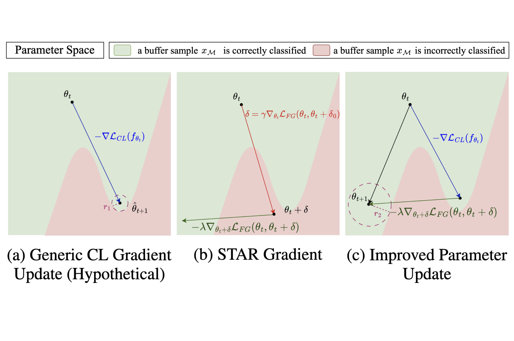
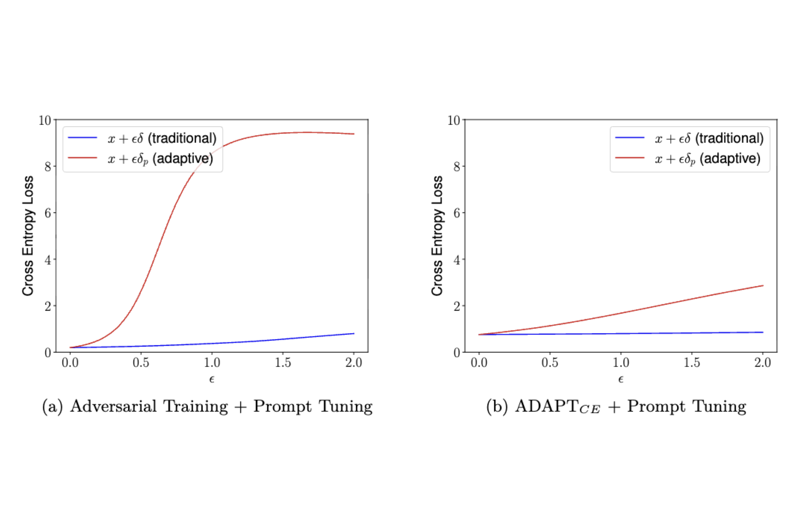
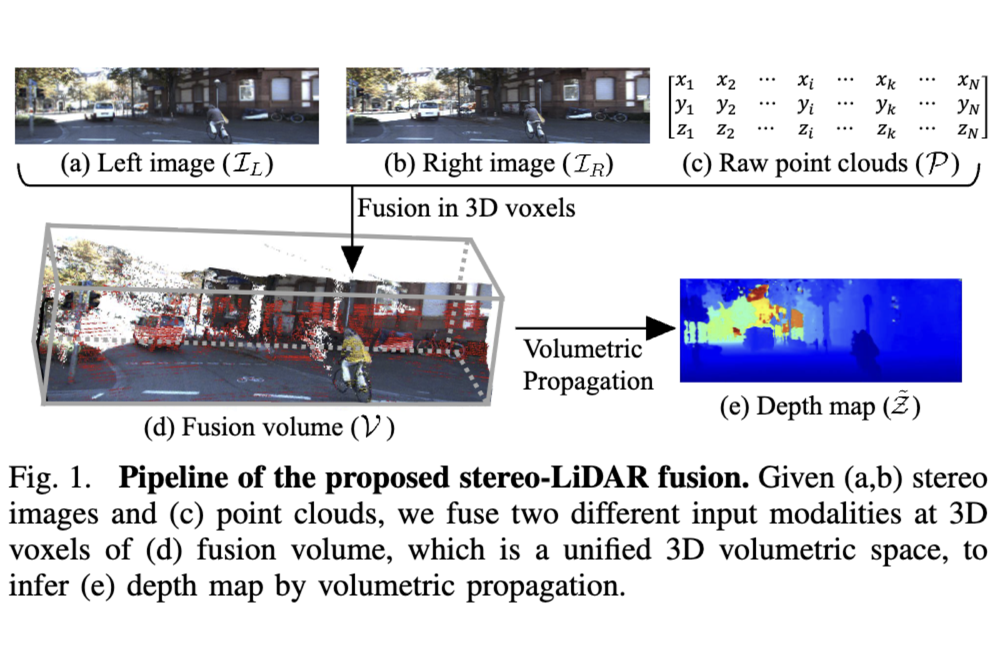
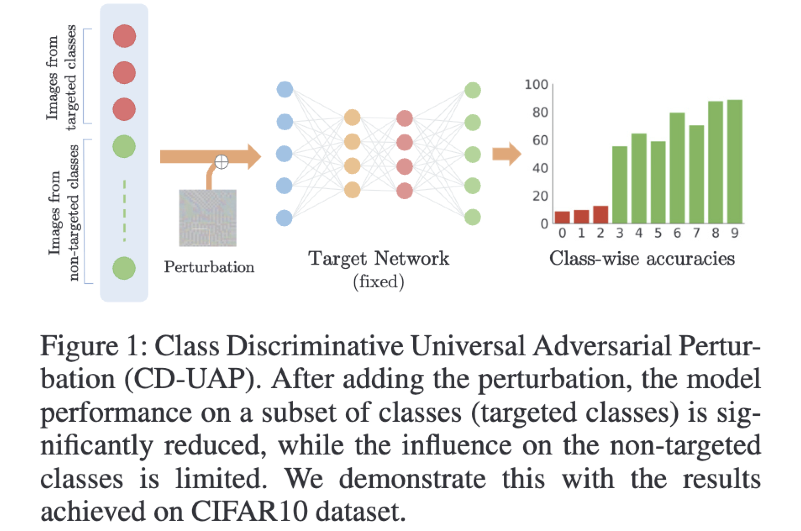
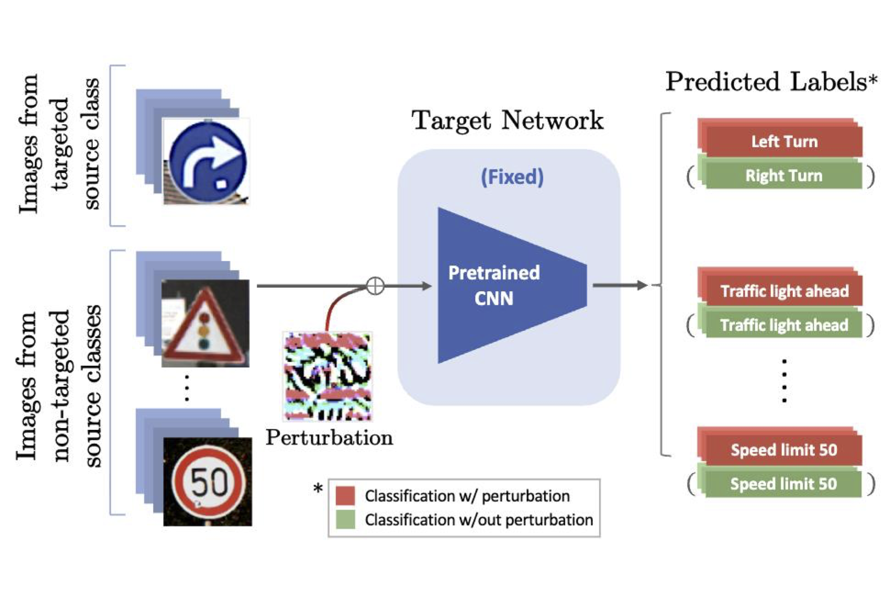
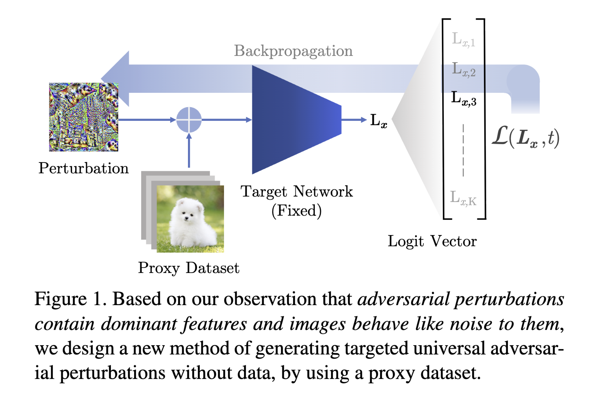
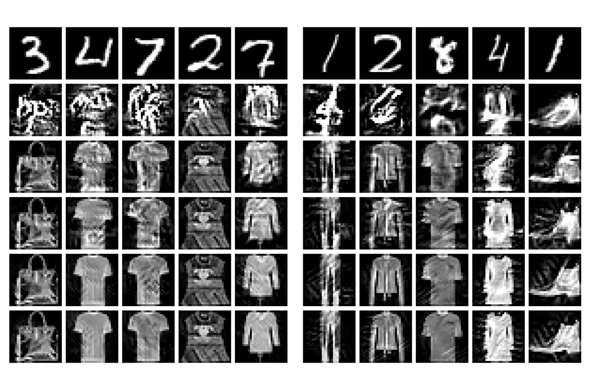

  

    
  

  

    <h3><a href="https://toobaimt.github.io/lvt/">LVT: Large-Scale Scene Reconstruction via Local View Transformers</a></h3>
    
ACM SIGGRAPH Asia 2025

    
<strong>Tooba Imtiaz*</strong>, Lucy Chai*, Kathryn Heal, Xuan Luo, Jungyeon Park, Jennifer Dy, John Flynn.
    Google (Research Internship)

    
LVT enables efficient reconstruction of large, high-resolution scenes in a single forward pass. By leveraging a linear-complexity neighborhood attention mechanism, conditioning on relative camera poses, and incorporating view-dependent opacity, we achieve state-of-the-art results across diverse datasets and variable sequence lengths.

  

  

    
  

  

    <h3><a href="https://openreview.net/forum?id=6N5OM5Duuj">STAR: Stability-Inducing Weight Perturbation for Continual Learning</a></h3>
    
International Conference on Learning Representations (ICLR) 2025

    
Masih Eskandar, <strong>Tooba Imtiaz</strong>, Davin Hill, Zifeng Wang, Jennifer Dy.
    Northeastern University, USA

    
In continual learning models, STAR exploits the worst-case parameter perturbation that reduces the KL-divergence of model predictions with that of its local parameter neighborhood to promote stability and alleviate forgetting. Empirically, STAR, which can be integrated as a plug-and-play component, consistently improves performance of existing rehearsal-based CL methods by up to 15% across several baselines.

  

  

    
  

  

    <h3><a href="https://arxiv.org/abs/2212.07495">SAIF: Sparse Adversarial and Imperceptible Attack Framework</a></h3>
    
Transactions on Machine Learning Research (TMLR), 2025

    
<strong>Tooba Imtiaz</strong>, Morgan Kohler, Jared Miller, Zifeng Wang, Mario Sznaier, Octavia Camps, Jennifer Dy. 
    Northeastern University, USA

    
We design imperceptible attacks that contain low-magnitude perturbations at a few pixels, and leverage these sparse attacks to reveal the vulnerability of classifiers. We use the Frank-Wolfe algorithm to simultaneously optimize the attack perturbations for bounded magnitude and sparsity with O(1/√T) convergence. Empirically, SAIF computes highly imperceptible and interpretable adversarial examples, and largely outperforms state-of-the-art sparse attack methods on ImageNet and CIFAR-10.

  

  

    
  

  

    <h3><a href="https://arxiv.org/abs/2403.13196">ADAPT to Robustify Prompt Tuning Vision Transformers</a></h3>
    
Transactions on Machine Learning Research (TMLR), 2025

    
Masih Eskandar, <strong>Tooba Imtiaz</strong>, Zifeng Wang, Jennifer Dy.
    Northeastern University, USA

    
ADAPT is a novel framework for performing adaptive adversarial training in the prompt tuning paradigm. It achieves competitive robust accuracy of ∼40% w.r.t. SOTA robustness methods using full-model fine-tuning, by tuning only ~1% of the number of parameters.

  

  

    
  

  

    <h3><a href="https://arxiv.org/pdf/2103.12964">Volumetric Propagation Network: Stereo-LiDAR Fusion for Long-Range Depth Estimation</a></h3>
    
IEEE Robotics and Automation Letters, 2021

    
Jaesung Choe, Kyungdon Joo, <strong>Tooba Imtiaz</strong>, In So Kweon. 
    KAIST, S. Korea.

    
VPN is a geometry-aware stereo-LiDAR fusion network for long-range depth estimation. It exploits sparse and accurate point clouds as a cue for guiding correspondences of stereo images in a unified 3D volume space. It achieves state-of-the-art performance on the KITTI and the VirtualKITTI datasets among recent stereo-LiDAR fusion methods.

  

  

    
  

  

    <h3><a href="https://ojs.aaai.org/index.php/AAAI/article/download/6154/6010">CD-UAP: Class Discriminative Universal Adversarial Perturbation</a></h3>
    
Proceedings of the AAAI Conference on Artificial Intelligence, 2020

    
Chaoning Zhang*, Philipp Benz*, <strong>Tooba Imtiaz</strong>, In-So Kweon. 
    KAIST, S. Korea.

    
We propose a new universal attack method to generate a single perturbation that fools a target network to misclassify only a chosen group of classes, while having limited influence on the remaining classes. Beyond class-discriminative UAPs, CD-UAP also achieves state-of-the-art performance for the original task of UAP attacking all classes.

  

  

    
  

  

    <h3><a href="https://openaccess.thecvf.com/content/ACCV2020/papers/Benz_Double_Targeted_Universal_Adversarial_Perturbations_ACCV_2020_paper.pdf">Double Targeted Universal Adversarial Perturbations</a></h3>
    
Proceedings of the Asian Conference on Computer Vision, 2020

    
Philipp Benz*, Chaoning Zhang*, <strong>Tooba Imtiaz</strong>, In So Kweon. 
    KAIST, S. Korea.

    
DT-UAPs attack one targeted source class to sink class, while having a limited adversarial effect on nontargeted source classes. Targeting the source and sink class simultaneously, we term it double targeted attack (DTA). This provides an attacker with the freedom to perform precise attacks on a DNN model while raising little suspicion. We show the effectiveness of the proposed DTA algorithm on various datasets and also show its potential as a physical attack.

  

  

    
  

  

    <h3><a href="http://openaccess.thecvf.com/content_CVPR_2020/papers/Zhang_Understanding_Adversarial_Examples_From_the_Mutual_Influence_of_Images_and_CVPR_2020_paper.pdf">Understanding Adversarial Examples From the Mutual Influence of Images and Perturbations</a></h3>
    
Proceedings of the IEEE/CVF Conference on Computer Vision and Pattern Recognition, 2020

    
Chaoning Zhang*, Philipp Benz*, <strong>Tooba Imtiaz</strong>, In So Kweon. 
    KAIST, S. Korea.

    
We treat DNN logits as feature vectors and use the Pearson correlation coefficient to analyze the mutual influence between independent inputs, enabling a disentangled analysis of clean images and adversarial perturbations. This analysis reveals that universal perturbations contain dominant features while images behave like noise, motivating a new method for generating targeted universal adversarial perturbations from random source images. Our approach is the first to achieve targeted universal attacks without access to original training data and attains performance comparable to state-of-the-art methods using only a proxy dataset.

  

  

    
  

  

    <h3><a href="https://adv-workshop-2020.github.io/short_papers/45.pdf">Data from Model: Extracting Data from Non-robust and Robust Models</a></h3>
    
CVPR 2020 Workshop on Adversarial Machine Learning in Computer Vision

    
Philipp Benz*, Chaoning Zhang*, <strong>Tooba Imtiaz</strong>, In So Kweon. 
    KAIST, S. Korea.

  

  

    
  

  

    <h3><a href="https://adv-workshop-2020.github.io/short_papers/46.pdf">Universal Adversarial Perturbations are Not Bugs, They are Features</a></h3>
    
CVPR 2020 Workshop on Adversarial Machine Learning in Computer Vision

    
Philipp Benz*, Chaoning Zhang*, <strong>Tooba Imtiaz</strong>, In So Kweon. 
    KAIST, S. Korea.

  

